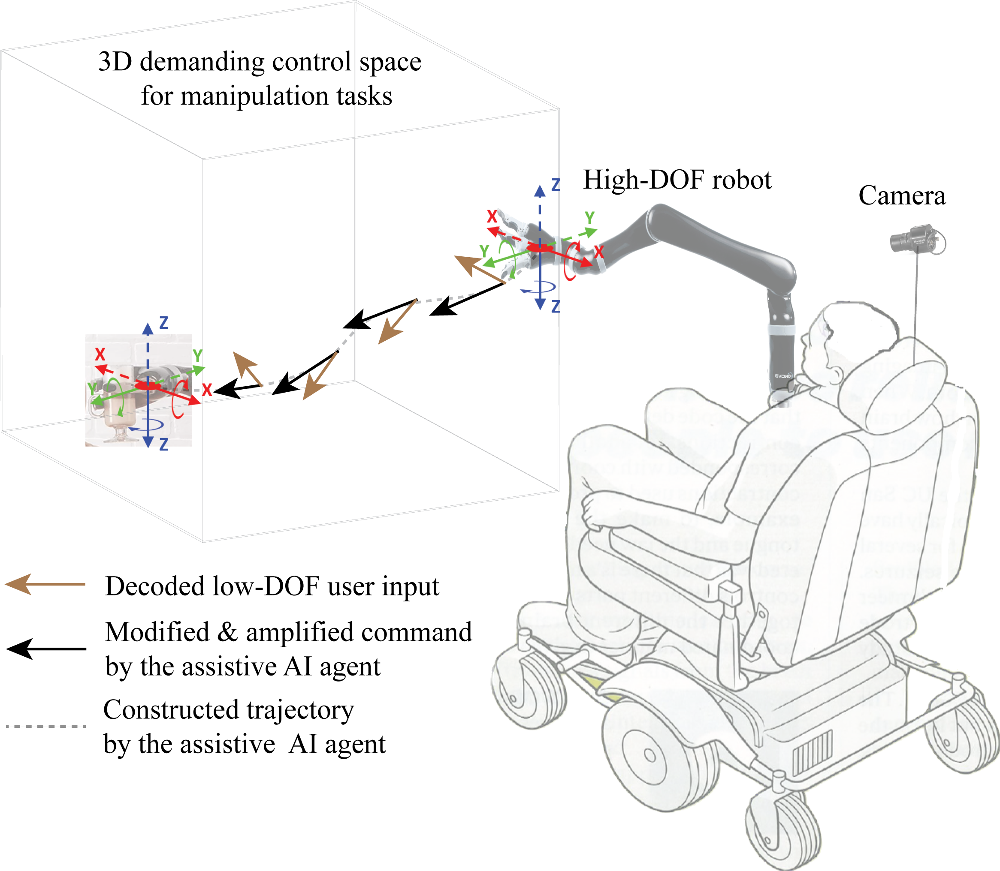
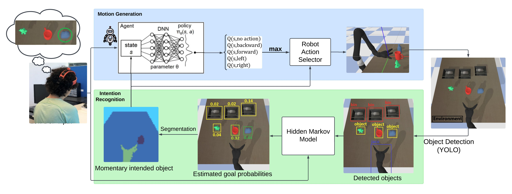

# ARAS (Adaptive Reinforcement learning for Amplification of limited inputs in Shared autonomy)





## Key features

- **Optimized Mapping**: Our approach learns an optimized mapping from limited user inputs to high-dimensional robotic actions, enabling intuitive control.
  
- **Target Audience**: Designed for users with severe impairments who require low-DoF (degrees of freedom) input methods for robotic control.

- **Adaptive Goal Prediction**: Simultaneously infers the user’s intended goal state in real-time, adapting continuously.

- **Reinforcement Learning Guidance**: Utilizes RL to guide the agent’s actions towards the intended goal, even when the specific goal is initially unknown.

- **Blending Autonomy with User Input**: Achieves a fluid combination of autonomous assistance and user input, addressing challenges faced by traditional blending and arbitration methods.


## Demo


## Install:

```bash
# Step 1: Clone the repository
git clone https://github.com/ali-rabiee/amplification_DRL.git

# Step 2: Navigate into the project directory
cd amplification_DRL

# Step 3: Create a virtual environment (optional but recommended)
# For Windows:
python -m venv venv
venv\Scripts\activate

# For macOS/Linux:
python3 -m venv venv
source venv/bin/activate

# Step 4: Install the required packages from requirements.txt
pip install -r requirements.txt
```
## Quick start
```bash
python3 testDQN.py
```
## Train
In config.py you have access to training parameters you want to set and then you can simply run:
```bash
python3 trainDQN.py
```
