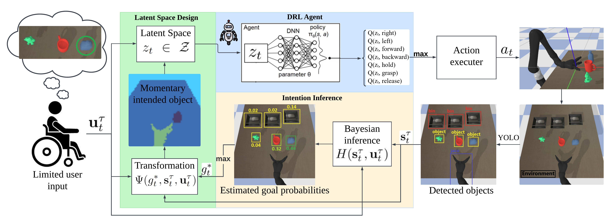

# ARAS (Adaptive Reinforcement learning for Amplification of limited inputs in Shared autonomy)




## Demo


## Overview

ARAS (Adaptive Reinforcement learning for Amplification of limited inputs in Shared autonomy) is a framework designed to assist users with severe mobility impairments in controlling robotic systems through limited inputs. By leveraging deep reinforcement learning, ARAS can amplify minimal user inputs into complex, goal-directed robotic movements while adapting to the user's intentions in real-time.

This repository implements three approaches for shared autonomy control:
1. **ARAS**: Our novel approach using latent space representations and adaptive goal inference
2. **DQN Baseline**: A standard deep Q-network implementation with raw inputs (baseline)
3. **Hindsight Optimization (HO)**: A belief-based optimization strategy for action selection (baseline)

## Key Features

- **Optimized Mapping**: Learns an optimized mapping from limited user inputs to high-dimensional robotic actions
- **Adaptive Goal Prediction**: Simultaneously infers the user's intended goal state in real-time
- **Blended Control**: Seamlessly integrates autonomous assistance with user inputs
- **Simulation Environment**: Built on PyBullet for realistic robotic manipulation tasks
- **Multiple Test Scenarios**: Supports fixed and dynamic scenarios to test robustness

## Repository Structure

### Key Files and Their Functionality

- **`config.py`**: Central configuration file for all parameters
- **`jaco_model.py`**: Implementation of the Jaco robotic arm model
- **`jaco_env.py`**: PyBullet environment for reinforcement learning with the Jaco arm
- **`networks.py`**: Neural network architectures for policy representation
- **`utils.py`**: Utility functions for data processing, visualization, and more
- **`trainDQN.py`**: Script for training DQN-based models (both ARAS and baseline)
- **`testDQN.py`**: Evaluation script for trained DQN models
- **`run_hindsight.py`**: Implementation and evaluation of Hindsight 
- **`hindsight_optimizer.py`**: Implementation of the Hindsight Optimization algorithm

## Installation

```bash
# Clone the repository
git clone https://github.com/your-username/ARAS.git
cd ARAS

# Create a virtual environment (recommended)
python -m venv venv
source venv/bin/activate  # On Windows: venv\Scripts\activate

# Install dependencies
pip install -r requirements.txt
```

## Usage

### Configuration

The `config.py` file is the central configuration hub. Key parameters include:

```python
# Testing parameters
RENDER = True  # Set to True to visualize the environment
modelPath = "./models/DQNBaseline_v7_bs64_ss4_rb30000_gamma0.5_decaylf20000_lr1e-05.pt"  # ARAS
# modelPath = "./models/DQN_baseline_v2_bs64_ss4_rb30000_gamma0.3_decaylf5000_lr1e-05.pt"  # DQN
SCENARIO = "dynamic_both"  # Options: "fixed", "dynamic_pickup", "dynamic_dropoff", "dynamic_both"
EPISODE_NUMBER = 500

# Training parameters
PRETRAINED_MODEL_PATH = ""  # Specify a path for fine-tuning
MODEL_NAME = 'ARAS'  # Options: 'DQN', 'ARAS'

# Hyperparameters
BATCH_SIZE = 64
GAMMA = 0.8  # Discount factor
EPS_START = 0.8  # Max exploration rate
EPS_END = 0.1  # Min exploration rate
EPS_DECAY_LAST_FRAME = 5000  # Exploration decay schedule
TARGET_UPDATE = 1000  # Target network update frequency
LEARNING_RATE = 1e-5
REPLAY_BUFFER_SIZE = 30000
Stack_Size = 4  # Number of frames to stack
```

### Training

To train a model, configure the parameters in `config.py` and run:

```bash
python trainDQN.py
```

Important training options:
- Set `MODEL_NAME` to either 'ARAS' or 'DQN' to select the model architecture and appropriate inputs
- For fine-tuning an existing model, set `PRETRAINED_MODEL_PATH` to the path of your current model
- Adjust hyperparameters as needed for your specific training scenario

The training progress will be logged in the `logs` directory, and models will be saved in the `models` directory.

### Testing

To evaluate a trained model:

```bash
python testDQN.py
```

Before testing, configure in `config.py`:
- Select the model to test by setting `modelPath` to either the ARAS or DQN baseline model
- Choose the scenario type with `SCENARIO` ("fixed", "dynamic_pickup", "dynamic_dropoff", or "dynamic_both")
- Set `RENDER = True` to visualize the environment during testing
- Adjust `EPISODE_NUMBER` to control the number of test episodes

Test results will be saved in the model-specific results directory.

### Hindsight Optimization

To run the Hindsight Optimization approach: (Select the Scenario in config.py)

```bash
python run_hindsight.py
```

Results will be saved in the `hindsight_results` directory.

## Models

### ARAS

ARAS uses a latent space representation to process inputs. It works with a segmentation-based observation space and is designed to better understand the semantic relationships between objects in the environment.

Key differences from baseline:
- Uses segmentation masks as input instead of raw grayscale images
- Enhanced ability to identify objects of interest and relevant goal locations
- Better performance in dynamic environments where goals change during execution

### DQN Baseline

The DQN baseline uses raw grayscale images as input to the neural network. It serves as a comparison point for the more advanced ARAS model.

### Hindsight Optimization (HO)

Hindsight Optimization maintains a belief distribution over potential goals and selects actions based on expected future outcomes. It generates synthetic user inputs and uses a forward model to evaluate action candidates.

## Test Scenarios

The environment supports four testing scenarios:

1. **Fixed** (`SCENARIO = "fixed"`): Static pickup and dropoff locations
2. **Dynamic Pickup** (`SCENARIO = "dynamic_pickup"`): The object to be picked up changes during the episode
3. **Dynamic Dropoff** (`SCENARIO = "dynamic_dropoff"`): The target dropoff location changes after the object is picked up
4. **Dynamic Both** (`SCENARIO = "dynamic_both"`): Both pickup and dropoff locations change dynamically

## Results and Performance Metrics

The testing scripts track several key metrics:
- Success rate: Percentage of successful task completions
- Average steps: Number of steps to complete the task
- User inputs: Amount of user inputs required
- Error actions: Actions that move away from the goal
- Amplified actions: Autonomous actions generated by the system

Results are saved as JSON files in the respective results directories.


## License

This project is licensed under the MIT License - see the LICENSE file for details.
